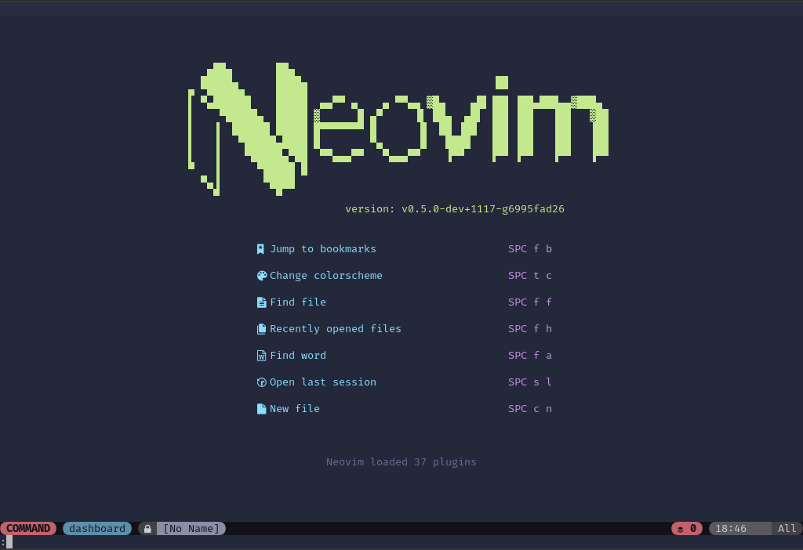
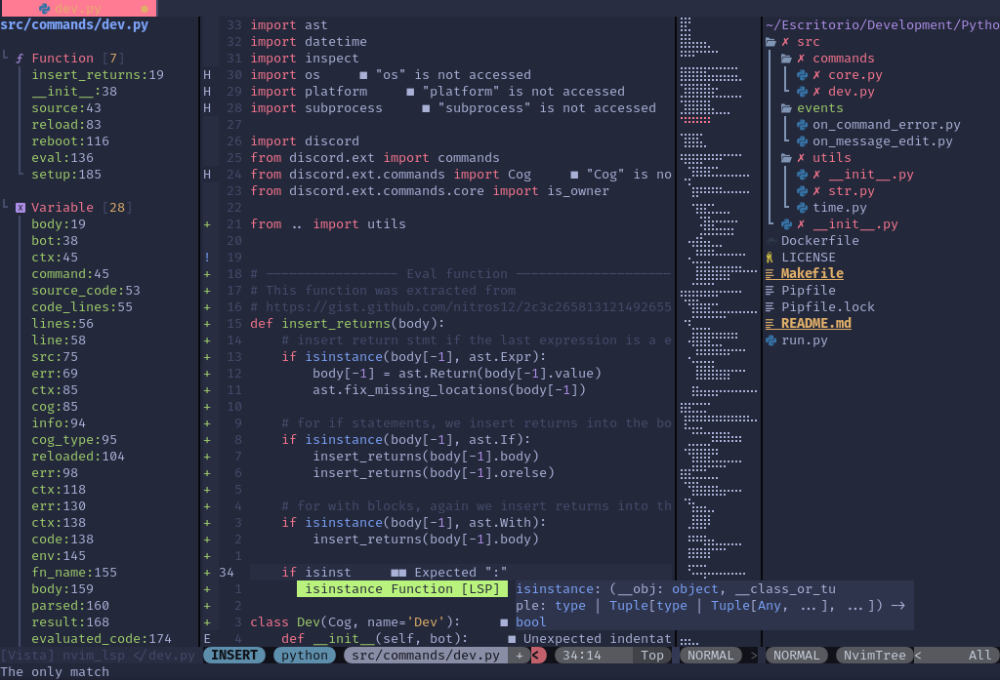
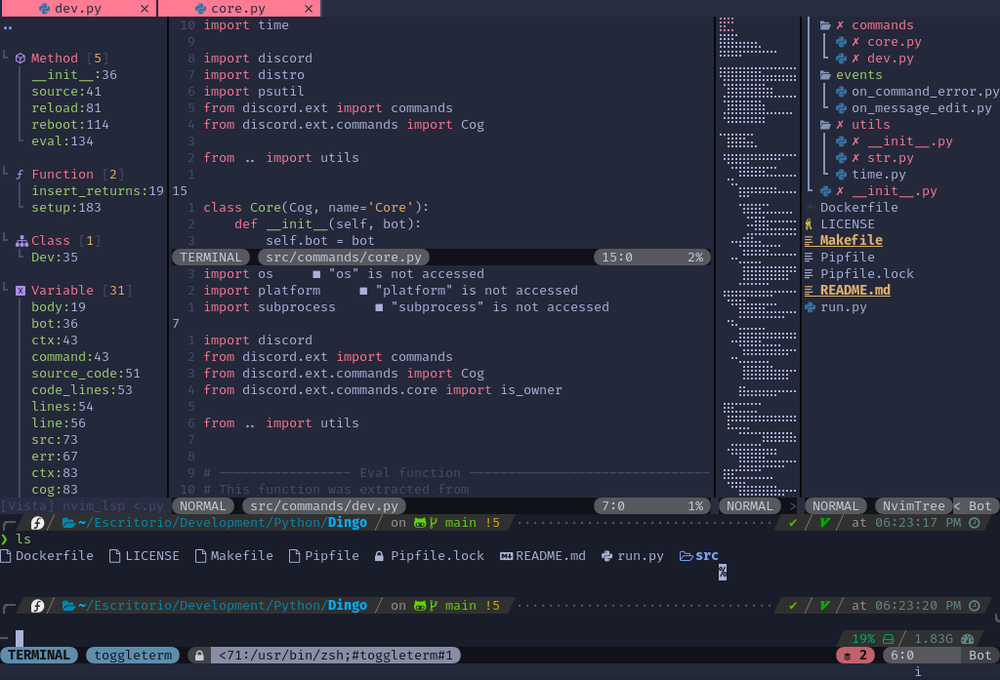
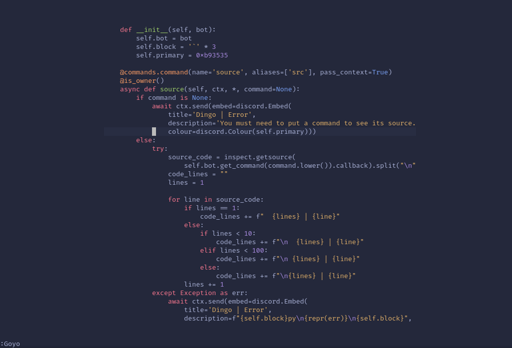

    
A completely powerful and fast Neovim setup for full-stack web
        development.

> **NOTE:** This setup requires Neovim nightly and Linux to work.

## Setup

1. Clone this repository and move the nvim folder to your configuration folder
   (`~/.config/nvim`).
2. Install [`packer.nvim`](https://github.com/wbthomason/packer.nvim).
3. Enter Neovim and then run `:PackerCompile` followed by `:PackerInstall`.
4. Restart Neovim and enjoy!

## Features

- Mouse support, for those who wants to use their mouse to work within Neovim.
- Autosave and auto formatting _you can keep doing it manually_.
- Fully featured keybindings and leader menu like SpaceVim.
- Distraction-free mode with [Goyo](https://github.com/junegunn/goyo.vim).
- Do you need to have several buffers open at the same time without worrying
  that the display will look bad due to the size of your screen? Don't worry,
  [focus.nvim](https://github.com/beauwilliams/focus.nvim) is already installed and configured!
- Totally written in Lua and mainly used plugins made in Lua, goodbye to the
  lack of Vimscript performance.
- Tree explorer with many functions and very good performance.
- Tags and symbols viewer.
- Better terminal integrations, why not?
- Better quickfix window.
- Git compatible editing, including [LazyGit](https://github.com/kdheepak/lazygit.nvim) integration
  (requires [LazyGit](https://github.com/jesseduffield/lazygit) to work)!
- Code Minimap (requires [code-minimap](https://github.com/wfxr/code-minimap) to work).
- Http client made in Rust, because also development needs to be
  fast (requires [dot-http](https://github.com/bayne/dot-http) to work)!
- Editing markdown has never been so easy, now you can also view it while you type!
- Fully powerful fzf with file previews and tons of integrations!
- Edit any file without sudo, when you save it you just put your password
  and that's it (see the Files menu)!
- Code runner.
- Quickly comment out blocks of code with [kommentary](https://github.com/b3nj5m1n/kommentary)!
- EditorConfig support, for those who work with it.
- Tree Sitter support.
- Built-in LSP for the following languages:
  - HTML/CSS
  - JavaScript/TypeScript (Also for Vue.js)
  - Python
  - Crystal

> For the LSP to work, please see [CONFIG.md](https://github.com/neovim/nvim-lspconfig/blob/master/CONFIG.md) instructions.

## Screenshots

|        Pyright in action         |               Multiwindow                |                Distraction-free UI                 |
| :------------------------------: | :--------------------------------------: | :------------------------------------------------: |
|  |  |  |

## License

Nvlood is [MIT Licensed](./LICENSE).
